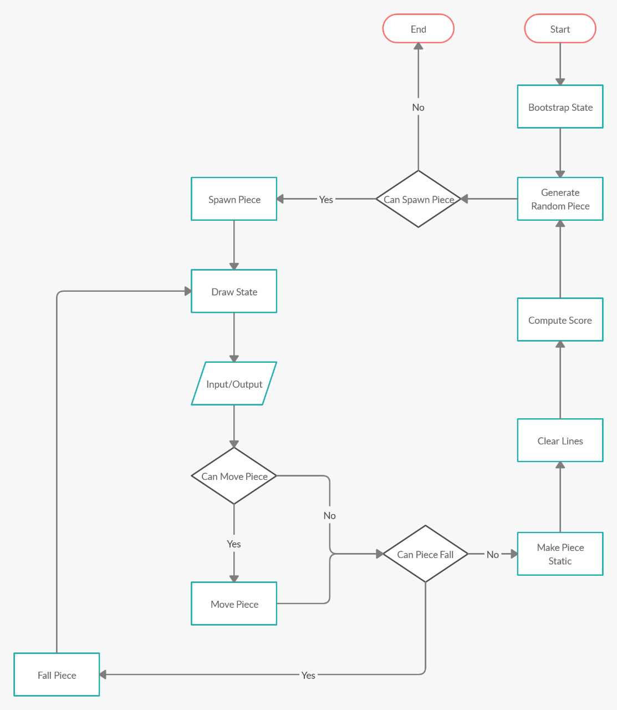

# CLTetris
A turn based command-line Tetris game implementation

## How to play

Input:
- 1: to move piece left
- 2: to move piece down
- 3: to move piece right
- 4: to turn piece clockwise
- 5: to turn piece counter-clockwise

## Flowchart

